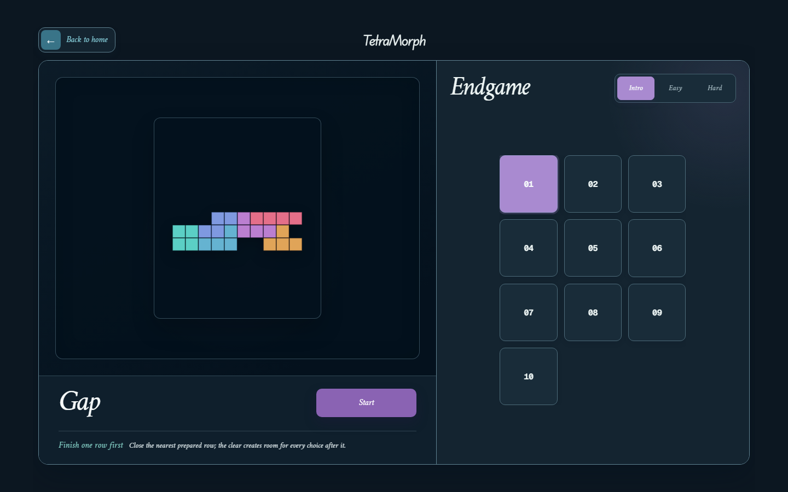

# TetraMorph

A modern mutation-driven falling-block game built for precise play,
readable pressure, and deterministic replay.

## Features

- **Classic Mode** — clear lines, build combos, and manage steadily rising gravity.
- **Survival Mode** — play above rising bedrock while clearable falling stones reshape
  the board.
- **Mutation Mode** — trigger visible item carriers and adapt to four temporary or
  immediate rule mutations.
- **Endgame Campaign** — solve 46 authored boards (5 introductory, 25 easy, 16 hard) with fixed queues, undo support, and
  a staged learning curve.

## Technical Highlights

- **PixiJS renderer** with one gameplay canvas and renderer-owned pieces, materials,
  particles, and effects.
- **Deterministic Core** isolated from React, PixiJS, browser timing, storage, and audio.
- **Replay system** with seeded runs and public state snapshots for reproducible QA.
- **Local Web Audio feedback** combines procedural synthesis with three pinned CC0 Ogg
  samples, without licensed music or runtime network media calls.
- **TypeScript architecture** with explicit Core, runtime, input, renderer, platform,
  persistence, and React composition boundaries.

## Controls

| Action | Keyboard |
| --- | --- |
| Move | `←` / `→` or `A` / `D` |
| Rotate clockwise | `↑`, `W`, or `X` |
| Rotate counter-clockwise | `Q` |
| Soft drop | `↓` |
| Hard drop | `Space` |
| Pause / resume | `P` |
| Settings | `S` |
| Restart confirmation | `R` |
| Endgame undo | `Z` |
| Back / close | `Esc` |
| Select / activate | Arrow keys / `Enter` |

Touch controls are available on compact portrait and landscape layouts. The interface
also supports Chinese and English, reduced-motion preferences, and adjustable SFX.

## Development

Requirements: Node.js 24.12.x (the tested CI baseline) and npm; install from the lockfile.

```bash
npm ci
npm run dev
```

Release gates:

```bash
npm run typecheck
npm run test
npm run build
npx playwright install chromium
npm run test:release
```

The deterministic game rules live in `src/game/core`; React owns page composition and
lifecycle, while PixiJS owns the single board canvas. Project contracts and release
evidence are maintained under `docs/`.

Current delivery and hosting instructions: [`docs/release/T38-RELEASE.md`](docs/release/T38-RELEASE.md).
The older rc.1 notes and screenshots below are historical. T38 visual/audio acceptance
is available locally at `/docs/evidence/t38/` under `npm run dev`; developer review
pages are not included in the production build. The project is a static browser app,
not an npm library. `private: true` does not prevent web hosting.

## Screenshots

### Mode selection


### Classic play


### Survival pressure


### Mutation impact


### Endgame campaign



### Settings


